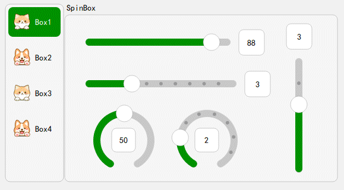

[简体中文说明](README.zh.md) | [English Documentation](README.md)

# QFluentUIForTouch

QFluentUIForTouch is a collection of Fluent Design UI plugins based on Qt, specifically optimized for touch screen devices.This project provides modern, smooth, and touch-friendly UI components for Qt applications.

## Project Structure

- `fluent_ui_plugin/`: Source code of the Fluent UI plugins, including main widget implementations (e.g., FluentPushButton, FluentToggleButton, etc.)
- `example/`: Example program demonstrating the actual effects and usage of the widgets
- `build/`: Compiled output files and plugins

## Key Features

- Developed with C++ and Qt, offering high performance and easy integration
- Supports Fluent Design style buttons, toggles, and other widgets
- Optimized for embedded touch screen operations with enhanced interaction experience
- Can be integrated into Qt Designer with drag-and-drop design support
- Easy to extend and customize


## Supported Widgets



- **FluentPushButton**: Fluent-style button
- **FluentToggleButton**: Fluent-style toggle button
- **FluentIconToggleButton**: Fluent-style square toggle button
- **FluentIconPushButton**: Fluent-style square button
- **FluentLineEdit**: Fluent-style line edit
- **FluentSpinBox**: Fluent-style spin box (integer input)
- **FluentCircleSpinBox**: Fluent-style circular spin box (integer input)
- **FluentLineSpinBox**: Fluent-style linear spin box (integer input)
- **FluentSlider**: Fluent-style slider
- **FluentProgressBar**: Fluent-style progress bar & scroll bar
- **FluentComboBox**: Fluent-style combo box
- **FluentText**: Fluent-style Label Text
- **FluentGroupBox**: Fluent-style group box
- **FluentTabBar**: Fluent-style tab bar
- **FluentTabWidget**: Fluent-style tab widget
- **FluentScrollBar**: Fluent-style scroll bar
- **FluentScrollArea**: Fluent-style scroll area
- **FluentCheckBox**: Fluent-style check box

## Getting Started

1. Clone the repository:
   
   ```bash
   git clone https://github.com/LeeGouDan1/QFluentUIForTouch.git
   ```
2. Open the QFluentUIForTouch.pro file with Qt Creator
3. Select a suitable Qt version (recommended: Qt 5.15.2 or later)
4. Build the project — the plugin files will be generated in the build/ directory
5. (Optional) Copy the plugin to Qt Designer’s plugin directory for visual integration

## Example

- The example/ directory contains a demo program that showcases the actual effects and usage of various Fluent UI widgets.
- You can compile and run it directly in Qt Creator.

## Contribution

- Contributions are welcome via Issues or Pull Requests to improve widget functionality or fix bugs.

## License

- This project is licensed under the MIT License. See LICENSE for details.

